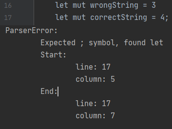
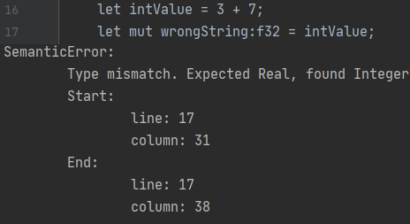

# RustCompiler


**Содержание**

<!--ts-->
   * [О компиляторе](#О-компиляторе)
      * [Лексический анализ](#Лексический-анализ)
	  	* [Объявление переменной](#Объявление-переменной)
		* [Объявление массива](#Объявление-массива)
		* [Обращение к элементу массива](#Обращение-к-элементу-массива)
		* [Условные конструкции](#Условные-конструкции)
		* [Циклы](#Циклы)
		* [Вывод](#Вывод)
		* [Объявление функции](#Объявление-функции)
		* [Функция sqrt()](#Функция-sqrt())
		* [Особенности](#Особенности)
		* [Синтаксические ошибки](#Синтаксические-ошибки)
		* [AST дерево](#AST-дерево)
      * [Семантический анализ](#Семантический-анализ)
	  	* [Семантические ошибки](#Семантические-ошибки)
      * [Генерация кода](#Генерация-кода)
   * [Авторы](#Авторы)
<!--te-->

# О компиляторе
Курсовая работа по предмету Системное программное обеспечение.
Простой транслятор с языка программирования Rust на <abbr title="Macro Assembler">MASM</abbr>.

## Лексический анализ
1. Поддержка целочисленных, вещественных, строковых, логических типов

2. Поддержка однострочных и многострочных комментариев

3. Сохраняется позиция начала и конца каждого токена

4. Поддержка следующих ключевых слов
<details>
       <summary>Список</summary>
       fn,
       for,
       if,
       loop,
       while,
       else,
       let,
       mut,
       f32,
       i32,
       usize,
       println,
       print,
       break,
       return,
       true,
       false,
       bool,
   </details>
	
## Синтаксический анализ

##### Объявление переменной
``` rust
    let var1; // без инициализации и без типа
    let var2: i32; // без инициализации и с типом
    let var3 = 3.0; // с инициализацией и без типа (тип определится сам)
    let var4:f32 = 5.0; // с инициализацией и с типом
```
##### Объявление массива
``` rust
    let arr1[i32; 4]; // без инициализации
    let arr2:[bool, 4] = [true, !false, false, !true]; // с инициализацией
```
Также переменная и массив могут быть помечены как *mutable* с помощью ключевого слова `mut`, например:
``` rust
    let mut var = 3+5;
```
Это означает что переменная может быть изменена больше одного раза.

##### Обращение к элементу массива

Поддерживается возможность доступа к произвольному элементу массива
``` rust
	let mut arr:[i32; 4] = [1,2,3,4];
	arr[3] = -4;
	arr[0] = arr[3];
```
##### Условные конструкции
``` rust
    if (a > 10 || a < -10) {
		// something
	}
	else if (b == 0 && a != 10) {
		// something
	}
	else ...
```
Количество `else` неограничено

##### Циклы
``` rust
	while (i < 100) {
		// something
	}
	loop { // бесконечный цикл, выход через break или return
		// something
	}
```
##### Вывод

Для вывода массива целиком используется формат вывода `{:?}`. Для переменной: `{}`
``` rust
	println!("array: {:?}\nvariable:{}", arr, var);
```
##### Объявление функции

Поддерживается объявление функции, которая может принимать как переменную, так и массив. Возвращаемым значением функции может быть переменная любого типа.
``` rust
	fn quick_sort(mut array: [i32; 10], first: usize, last: usize) {
		// something
	}
```
##### Функция sqrt()

Для чисел типа `f32` поддерживается вызов функции sqrt через точку. Выражение вернет корень вещественного числа.
``` rust
	let two = 2.0;
	let sqrVar = two.sqrt();
```
##### Особенности

- Программа на входном языке должна содержать хотя бы одну функцию.
- Внутри каждого блока с фигурными скобками может быть неограниченное количество вложенных блоков. Также может быть **неограниченное число вложенных конструкций** `if ... else`, `while`, `loop`
- Инициализировать переменную можно **любым выражением**, имеющий какой-либо **значимый тип**. Таким образом после знака равно может быть любое арифметическое или логическое выражение, состоящие из переменных, вызовов функций, обращений к элементам массива. Проверка на соотвествие типов происходит в семантическом анализе. 
- Индексом для обращения к элементу массива также может быть любое выражение (см. пункт выше)

##### Синтаксические ошибки

При возникновении синтаксической ошибки компилятор прекращает дальнейший разбор и оповещает пользователя о соответствующей синтаксической ошибке. При этом компилятор выводит место, в котором произошла синтаксическая ошибка и предполагает что должно было быть на этом месте.



##### AST дерево

На этапе синтаксического анализа происходит построение абстрактного синтаксического дерева для дальнейшего использования в семантическом анализе и генерации кода.

## Семантический анализ

Осуществляет проверку на семантическую корректность исходного текста программы. *Реализованные проверки:*
- Соответствие типов данных в арифметических и логических выражениях.
- Соответствие типов данных при инициализации и присваивании переменной и массива
- Соответствие размера массива и числа присваиваемых элементов
- Проверка на существование переменной и массива при их использовании
- Проверка на инициализацию переменной при ее использовании (недопускается использование неинициализированных переменных и массивов)
- Проверка на повторное присваивание переменной или массива, не помеченного как `mut`
- Проверка объявление переменной или массива с уже существующим именем
- Поддержка **локальных переменных и массивов**
- Проверка обращения по индексу массива. Недопускаются отрицательные константы в индексе
- Проверка условий в конструкциях `if` и `while`. Допускаются условия только типа `bool`
- Проверка соответствия числа форматов вывода и передаваемых аргументов в функции `println!()`. Таже недопускается исользование формата вывода массива для переменной и наоборот.
- Проверка на существование вызываемой функции
- Проверка на соответствие числа и типов передаваемых в функцию агументов
- Проверка на наличие в функции ключевого слова `return` и соответствие возвращаемого значения

##### Семантические ошибки

В случае семантической ошибки компилятор прекращает дальнейший разбор и выводит описание ошибки и ее место в тексте.



## Генерация кода

Выходным языком был выбран <abbr title="Macro Assembler">MASM</abbr>
- Все переменные и массивы в ассемблере объявляются как локальные для каждой функции. Для того, чтобы избежать повторения имен, в случае если переменные являются локальными на языке Rust, повторяющиеся имена помечаются дополнительным нижним подчеркиванием `_`
- В корне с компилятором находится папка, содержащая бинарный файл со всеми ключевыми словами языка ассемблер. Если название переменной на языке Rust совпадает с ключевым словом на ассемблере, то она дополнительно помечается нижним подчеркиванием
- В ассемблере были использованы два типа данных: `DWORD` и `REAL8`
- Параметры в функции передаются только через стек

# Авторы
Студетны 2-го курса *БГТУ "Военмех"*  группы *И584*
&copy; 2020 Ветик Артём & Труфанов Глеб 
